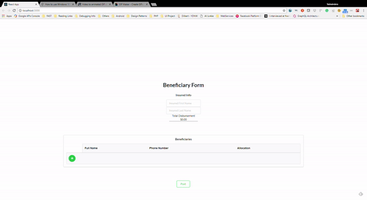

# grid
This is an implementation for a reusable grid component that takes in a column definition with injectable editor types and renders itself in the parent redux form and when values are added the values are added back to the redux form component that renders it.

The implementation relies on [semantic-ui-react](https://react.semantic-ui.com/introduction) and is meant to comply with [ReduxForm](https://redux-form.com/7.2.3/).  



### Usage
```javascript
import CurrencyField from '../path/to/CurrencyField';
import PhoneField from '../path/to/PhoneField';
// this is where you have the grid code in your source
// this will be changed to an npm module soon
import Grid from '../path/to/Grid'; 
import {Form, Field, FieldArray } from 'redux-form'


const renderField = ({input}) => <input name={input.name} value={input.value} />

const columnDef = [
  {
    dataIndex: 'name',
    name: 'Full Name',
    order: 1
  },
  {
    dataIndex: 'phone',
    name: 'Phone Number',
    order: 2,
    editor: PhoneField
  },
  {
    dataIndex: 'money',
    name: 'Money',
    order: 3,
    editor: CurrencyField
  }
];
export default function SampleForm(props: Object){
  return(
    <Form onSubmit={props.submitHandler(() => alert(JSON.stringify(values)))}>
      <Field name="testField" component={renderField} />
      <FieldArray component={Grid} columnModel={columnDef} name="sampleGrid" editable title="Sample Grid" />
      <button type="submit">Submit</button>
    <Form>
  )
}
<Form onSubmit={props.submitHandler}>
<FieldArray component={Grid}
```


#### Static Grid

This implementation also exposes a static data table version with the same column model driven instances. Usage for that is simpler. Both the versions take in a `data` prop and a decorated `getData` action creator (redux users) as ways to pass in initial data. The static grid would need these props to load its data. Either just `data` can be passed or `getData` and `data` have to be passed together where the action creator updates the `data` prop that is tied to a piece or redux state or is somehow updated to finally contain the data to be rendered.

```xml
<Grid data={data} name="staticGrid1" columnModel={columnModel} />

// Remote source or some action creator that updates the data prop to load data into the static grid
<Grid data={data} name="staticGrid2" columnModel={columnModel} getData={getData} />

```
